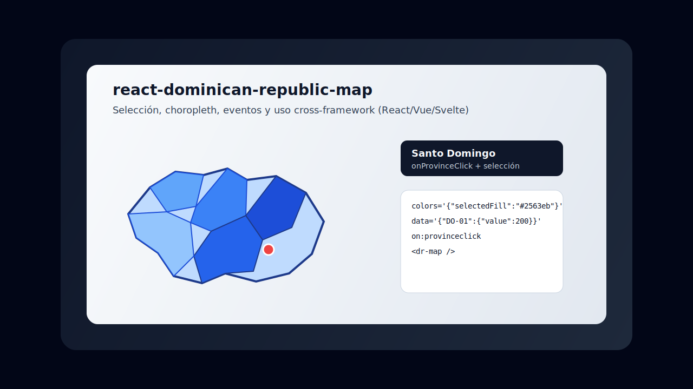

# dominican-republic-map

[](https://github.com/uppy19d0/react-dominican-republic-map/actions/workflows/ci.yml)
[](./LICENSE)

Mapa SVG interactivo y táctil de la **República Dominicana**. Incluye las 32 provincias, selección, choropleth, marcadores, zoom/pan con rueda y pellizco, tooltips, teclado y estilos listos para producción.

Creado por [Luis Aneuris Tavarez De Jesus](https://www.ltavarez.me/).

## Screenshot



## Features

- 32 provincias con paths SVG embebidos (sin dependencias de mapas externas)
- Interacción mouse + touch: tap, hover, long focus, pinch-zoom, pan, double-tap zoom
- Selección simple o múltiple (controlada o no controlada)
- Choropleth por valores numéricos con escala de color interpolada
- Marcadores personalizables sobre el mapa
- Tooltips nativos o render propio
- Labels de abreviatura opcionales
- Accesible: `role="button"`, teclado Enter/Espacio, `aria-*`
- TypeScript completo
- CSS con variables para theming
- Paleta de colores unificada con prop `colors`
- Zero runtime dependencies (solo peer `react` / `react-dom`)
- Soporte cross-framework con Web Component (`<dr-map>`) para React, Vue, Svelte, etc.

## Installation

```bash
npm install dominican-republic-map
```

## Framework support

- React: usa `DominicanRepublicMap`
- Vue / Svelte / Angular / Vanilla JS: usa `<dr-map>` (Web Component estándar)
- Guías por framework: [docs/frameworks](./docs/frameworks/README.md)

## Quick Start

```tsx
import { DominicanRepublicMap } from "dominican-republic-map";
import "dominican-republic-map/styles.css";

export function App() {
  return (
    <DominicanRepublicMap
      showLabels
      enableZoom
      data={{
        "DO-01": { value: 120, label: "120 proyectos" },
        "DO-25": { value: 80, label: "80 proyectos" },
        "DO-32": { value: 200, label: "200 proyectos" },
      }}
      onProvinceClick={({ province }) => {
        console.log(province.name, province.region);
      }}
    />
  );
}
```

## Props

| Prop | Type | Default | Description |
| --- | --- | --- | --- |
| `data` | `ProvinceData` | — | Valores / estilos por provincia |
| `selectionMode` | `"none" \| "single" \| "multiple"` | `"single"` | Modo de selección |
| `selectedProvinces` | `ProvinceId[]` | — | Selección controlada |
| `enableZoom` | `boolean` | `true` | Zoom rueda / pellizco / pan |
| `showZoomControls` | `boolean` | `true` | Botones + / − / reset |
| `showLabels` | `boolean` | `false` | Abreviaturas en el mapa |
| `showTooltip` | `boolean` | `true` | Tooltip al hover/focus |
| `colors` | `MapColors` | — | Paleta unificada (`defaultFill`, `selectedFill`, etc.) |
| `colorScale` | `string[]` | blues | Escala choropleth |
| `markers` | `MapMarker[]` | `[]` | Puntos sobre el mapa |
| `onProvinceClick` | `(e) => void` | — | Click / tap / Enter |
| `onProvinceDoubleClick` | `(e) => void` | — | Doble click / doble tap |
| `onSelectionChange` | `(ids) => void` | — | Cambio de selección |
| `onMapClick` | `(e) => void` | — | Click en el fondo del SVG |
| `getProvinceStyle` | `(province, state) => style` | — | Estilo custom por provincia |

Ver [docs/api.md](./docs/api.md) para la API completa.

## Data helpers

```ts
import {
  PROVINCES,
  REGIONS,
  getProvince,
  findProvinceByName,
  getProvincesByRegion,
} from "dominican-republic-map";

getProvince("DO-25"); // Santiago
findProvinceByName("Pedernales");
getProvincesByRegion("Cibao Norte");
```

## Examples

Ejemplos completos: [examples/README.md](./examples/README.md)

### React (componente)

```tsx
import { DominicanRepublicMap } from "dominican-republic-map";
import "dominican-republic-map/styles.css";

<DominicanRepublicMap
  colors={{
    defaultFill: "#dbeafe",
    selectedFill: "#1d4ed8",
    markerFill: "#dc2626",
  }}
  onProvinceClick={({ province }) => console.log("React:", province.id)}
/>;
```

### Vue / Svelte / Angular / otros (Web Component)

```ts
import "dominican-republic-map/element";
import "dominican-republic-map/styles.css";
```

> Nota: esta librería usa React internamente, así que en Vue/Svelte también debes tener instalados `react` y `react-dom` (peer dependencies).

```html
<dr-map
  show-labels
  selection-mode="multiple"
  colors='{"defaultFill":"#dbeafe","selectedFill":"#1d4ed8"}'
></dr-map>
```

Eventos DOM:

```ts
const map = document.querySelector("dr-map");
map?.addEventListener("provinceclick", (event) => {
  console.log("Web component:", event.detail.province.id);
});
```

### Angular quick use

```ts
// main.ts
import "dominican-republic-map/element";
import "dominican-republic-map/styles.css";
```

```ts
// app.module.ts
import { CUSTOM_ELEMENTS_SCHEMA, NgModule } from "@angular/core";

@NgModule({
  schemas: [CUSTOM_ELEMENTS_SCHEMA],
})
export class AppModule {}
```

```html
<dr-map show-labels selection-mode="single"></dr-map>
```

### Vue / Svelte / Vanilla (runnable)

```bash
npm --prefix examples/vue install && npm run example:vue
npm --prefix examples/svelte install && npm run example:svelte
npm --prefix examples/vanilla install && npm run example:vanilla
```

### HTML standalone (sin build)

```bash
npm run demo
# o
npx serve examples/standalone
```

Archivo: [`examples/standalone/index.html`](./examples/standalone/index.html)  
También en [`docs/demo/index.html`](./docs/demo/index.html).

> `examples/basic/index.html` es un entry de **Vite + React**. No funciona abriéndolo como `file://`; usa el comando de abajo.

### Example React (Vite)

```bash
npm install
npm run example
```

El example en `examples/basic` muestra choropleth, selección múltiple, marcadores y zoom táctil.

## Docs

- [API](./docs/api.md)
- [Theming](./docs/theming.md)
- [Touch & zoom](./docs/gestures.md)
- [Framework guides](./docs/frameworks/README.md)

## License

MIT © Luis Aneuris Tavarez De Jesus
